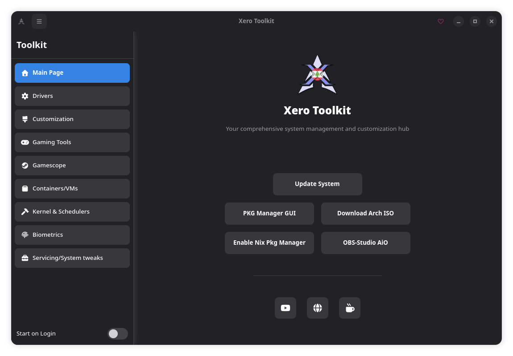

import { Image } from 'astro:assets';
import km from '../../assets/images/KM.png';
import scx from '../../assets/images/SCX.png';

<p class="page-tagline" id="distro-tagline"></p>

<script>{`
(function() {
  const taglines = [
    'Arch Linux, but make it <code>pretty</code>.',
    'Where <code>pacman -Syu</code> is a lifestyle, not a chore.',
    'Riced out of the box — no weekend lost to dotfiles.',
    'Because vanilla Arch is just the <code>base-devel</code>.',
    'KDE Plasma + Arch = <code>peak_desktop</code>.',
    'Your hardware deserves better than a default <code>.bashrc</code>.',
    'Not just another Arch spin — a whole <code>vibe</code>.',
    'We did the ricing so you don\\u0027t have to <code>--force</code> it.',
    'Stability meets aesthetics — no <code>dependency hell</code> included.',
    'Built for the users who think <code>neofetch</code> screenshots matter.',
    '<code>btw</code>, this is the distro you\\u0027ve been looking for.',
    'From <code>archiso</code> to eye candy in one install.',
  ];
  const el = document.getElementById("distro-tagline");
  if (el) el.innerHTML = taglines[Math.floor(Math.random() * taglines.length)];
})();
`}</script>

Before we begin, I would like to tell everyone of you who has supported the **XeroLinux** project by either getting the ISO or some merch, how much your simple act of kindness means to me. I cannot put it into words. So all am gonna say is God bless you all. I hope your kindness is reciprocated.

**XeroLinux** is a KDE Plasma-based Arch Linux distribution focused on aesthetics and usability. For mid-range or higher hardware, it provides a polished out-of-the-box experience. It can run on lower-end systems, but performance may vary.


:::note
Always update and reboot post-install before using the Distro. If you prefer not to use the ISO, the same result can be achieved with the [**XeroInstall script**](/xero-install/) on a base Arch install.
:::

---

## ISO Variants

XeroLinux ships as **two separate ISOs**:

- **Standard ISO** — For **Intel** and **AMD** GPU systems
- **nVidia ISO** — For **RTX**-series cards using modern open drivers

:::caution
Legacy nVidia 900/1000 series cards are **not supported** by the nVidia ISO. Use the Standard ISO and install the legacy 580xx drivers manually via the [toolkit](/xero-tool/). The ISO will boot in `nomodeset` (low-res) until drivers are installed. No support is provided for these legacy drivers.
:::

We split **XeroLinux** into two ISOs because **nVidia** retired the old 900 and 1000 series cards from the modern driver lineup — only **RTX** cards get the latest open drivers. Instead of forcing everyone into a one-size-fits-nobody installer, the dedicated **nVidia** ISO is built specifically for RTX users, while the Standard ISO keeps Intel and AMD systems happy. Each ISO does exactly what it's meant to do, with fewer surprises and better reliability.

We also tried our best to make the **nVidia** ISO robust by including laptop support and many other optimizations.

---

## GPU Swap Detection

**XeroLinux** includes a small background service that checks which graphics hardware is inside your computer by reading standard system information. When it notices a change — for example, if you install an **nVidia** card or remove one — it records the change and shows a popup notification in Plasma. Nothing runs unless something actually changes.

When you choose to continue, **XeroLinux** opens an easy-to-use tool that installs or removes the correct graphics drivers based on your current hardware. The tool updates system components like the boot configuration and kernel modules automatically. Supports **Intel**, **AMD**, **nVidia**, and hybrid setups.

---

## Boot Requirements

| Requirement | Details |
|-------------|---------|
| Firmware | **UEFI** & Legacy **BIOS/MBR** are now supported |
| Boot tool | [**Ventoy**](https://xerolinux.xyz/posts/ventoy-multi-boot/) recommended (provides GRUB fallback) |
| Session | **Wayland** only — X11 has been fully dropped by KDE Plasma but can be enabled via toolkit |

:::tip
Avoid burning with Etcher or similar tools — there's no fallback if SystemD-Boot fails. Use Ventoy instead.
:::


---

## Calamares Installer

**XeroLinux**, like many other distros, uses the [**Calamares**](https://codeberg.org/Calamares/calamares) installer.


We have been able to re-enable encryption, allowing you to encrypt your drives using `luks2`. We have also added the ability to update the system during install, so you might notice it taking a little bit longer — depends on how many updates there are at the time of install, their size, and your connection speed. Please be patient while it does that.

---

## Post-Install Setup

### XeroLinux Toolkit

I highly recommend using the toolkit (the first icon on the dock) to streamline your initial setup experience. It was designed to make the process much smoother and more pleasant. Keep in mind, however, that it's not meant to handle everything for you — just the essentials.



If updating from an older toolkit version, the dock icon may disappear. Run the following to restore it, then restart the shell with `rshell`:

```bash
sed -i.bak \
  -e '\|^localPath=/home/|d' \
  -e 's|^url=file:///usr/share/applications/xapit-cli.desktop$|url=file:///usr/share/applications/xero-toolkit.desktop|' \
  "$HOME/.config/plasma-org.kde.plasma.desktop-appletsrc"
```

### Fingerprint Support

An in-house fingerprint GUI tool is available via the toolkit.


:::note
Polkit may still prompt for a password — swipe your finger to authenticate. Terminal authentication works out of the box. For SDDM details, see [**this guide**](https://xerolinux.xyz/posts/xero-fingerprint/).
:::

---

## Filesystem & Swap

| Feature | Options |
|---------|---------|
| Filesystems | `xfs`, `ext4`, `btrfs` |
| Encryption | LUKS2 |
| Swap | zRAM via [**zram-generator**](https://github.com/systemd/zram-generator) |

Check zRAM status with `zramctl --output-all`. See the zram-generator documentation for configuration.

---

## Package Managers

No GUI package managers are included by default, as I believe in giving you the freedom to choose the one that suits your workflow best. Through the provided toolkit, you can select from **Octopi**, **Bauh**, or **Bazaar**.

:::danger
I strongly advise against installing KDE's **Discover** if you're aiming for stability — it's notoriously troublesome. But, as always, the final decision is yours.
:::

---

## Kernel Manager / SCX

The toolkit includes a **Kernel Manager** and **sched-ext** tool for kernel tuning.

<div class="img-row">
  <Image src={km} alt="Kernel Manager" />
  <Image src={scx} alt="SCX Scheduler" />
</div>

---

## Troubleshooting

### Pacman DB Error

If you encounter `unknown key "%INSTALL_DB%" in local database` during updates:

```bash
sudo find /var/lib/pacman/local/ -type f -name "desc" -exec sed -i '/^%INSTALLED_DB%$/,+2d' {} \;
```

Alternatively, use **Pacman DB Fix** in the toolkit under **Servicing/System Tweaks**.

---

## Support

If you encounter any issues or have questions directly related to the installation, feel free to reach out on [**Fosstodon**](https://fosstodon.org/@XeroLinux) or [**Discord**](https://discord.gg/5sqxTSuKZu). Please do not ask on Ko-Fi.


However, if your questions are related to your specific hardware, I may not have the answers you're looking for, as my knowledge is limited to what works on my own systems. For hardware-specific queries, your best resources are the [**ArchWiki**](https://wiki.archlinux.org) or community Discord.

That's it, there ain't much to it. The rest is in your hands now. Dive into the toolkit, poke around, and see if there's anything that catches your fancy.
