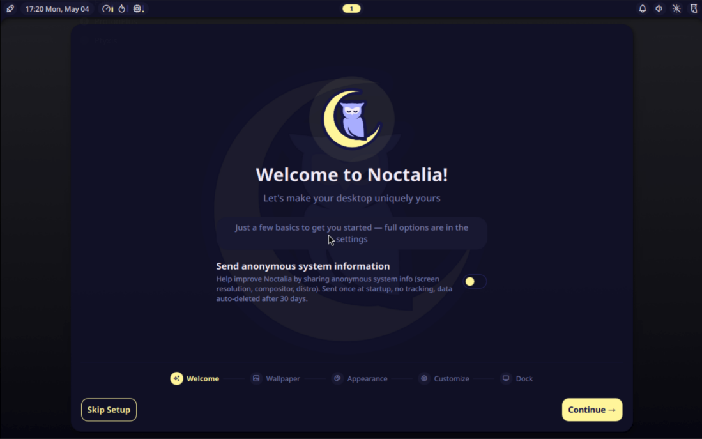

:::caution
We will not be held responsible for any issues. It has been thoroughly tested on **XeroLinux**. We do accept new ideas and suggestions on [Community Discord](https://discord.xerolinux.xyz).
:::

Install HyprNoc with ease

  <iframe
    src="https://www.youtube.com/embed/YPlgg1m9sBA"
    allowfullscreen>
  </iframe>

---

## What's this?

**HyprNoc** is an option inside the **XeroLinux T.U.I Installer** that installs **[Hyprland](https://wiki.hypr.land)** paired with the **[Noctalia Shell](https://noctalia.dev)** instead of **KDE Plasma**. It comes with a minimal amount of pre-configuration, just enough to give you a solid starting point without getting in your way.

The look has been tweaked slightly so things feel put-together from the start, but keybinds, behaviour, and everything under the hood remain stock. No strong opinions baked in. From there it is entirely up to you. Configure it your way, apply a rice, pull in community configs, or use setup bots from the **[Hyprland](https://wiki.hypr.land)** ecosystem.

---

## Why Hyprland?

Here at **XeroLinux HQ**, we chose **[Hyprland](https://wiki.hypr.land)** because we consider it the most mature and feature-rich Wayland compositor available right now. It has a well-established ecosystem, active development, and solid community support that makes it a strong default choice.

  <iframe
    src="https://www.youtube.com/embed/5OPA2MlUi9Y"
    allowfullscreen>
  </iframe>

That said, it is a choice, not a rule. **[Noctalia Shell](https://noctalia.dev)** is not locked to **[Hyprland](https://wiki.hypr.land)**. If you prefer a different window manager, there are plenty of great options out there to pair it with. Pick what fits your workflow and your taste.

---

## Hyprlang to LUA

**[Hyprland](https://wiki.hypr.land)** is making a significant move, replacing its old custom **hyprlang** config syntax with **Lua** scripting. The original `k = v` format served its purpose in the early days but grew cluttered and limiting over four years of development. **Lua** brings a cleaner, more readable, and far more capable replacement.

With **Lua** configs you get access to things that were previously plugin-only territory: timers, events, callbacks, layout data, and more, all built directly into your config. It is a proper scripting language, not a workaround.

  <iframe
    src="https://www.youtube.com/embed/8jiGCesJpgo"
    allowfullscreen>
  </iframe>

:::note
Existing `hyprland.conf` files keep working as long as no `hyprland.lua` is present. **Hyprland** checks for a Lua config only at startup, so switching between formats requires a restart. Legacy hyprlang support has a grace period of 1 to 2 releases starting from v0.55, after which it will be dropped. New features will only target the **Lua** config going forward. For reference, see the [**official announcement**](https://hypr.land/news/26_lua).
:::

---

## Installation

**[Hyprland](https://wiki.hypr.land)** + **[Noctalia Shell](https://noctalia.dev)** is available as a built-in option inside the **XeroLinux T.U.I Installer**. When going through setup, you will be presented with a choice of desktop environment. Simply select it from the menu and the installer handles the rest. No extra scripts, no manual steps. Boot in, make your pick, and walk away with a working setup.

---

## Wrap Up

A genuine thank you to **[Linux Gamer Life](https://www.youtube.com/@LinuxGamerLife/videos)** and **[The Black Don](https://www.youtube.com/@TheBlackDon/videos)** for the inspiration and support that made this possible.

Watching both of them rock **[Noctalia Shell](https://noctalia.dev)** on **Niri** is what got me interested in bringing **Noctalia** into the **XeroLinux** world. They showed just how good a clean, well-paired shell setup can look and feel, and that energy was hard to ignore. Worth noting that they run **Niri**, not **[Hyprland](https://wiki.hypr.land)**, which is a great reminder that **[Noctalia](https://noctalia.dev)** is compositor-agnostic and works beautifully across different setups.

If you have not checked out their content yet, do yourself a favor and go give them a watch. You will not regret it.
