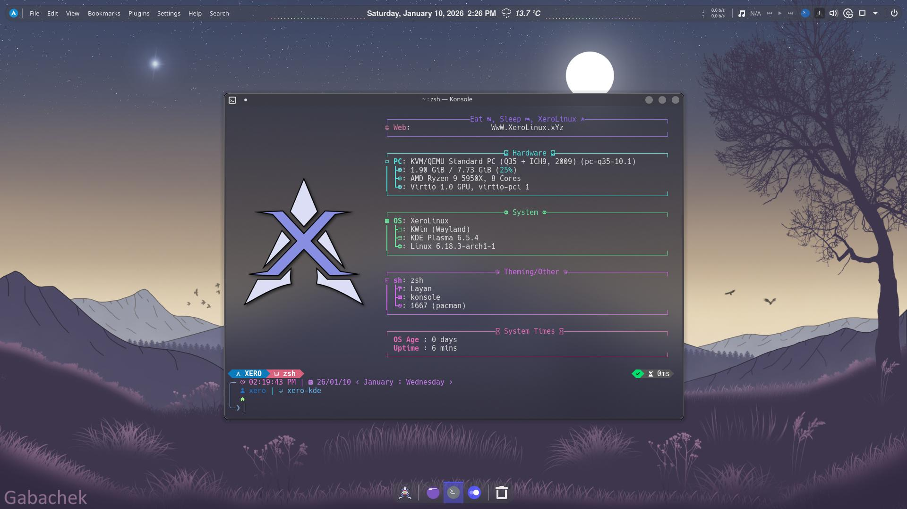
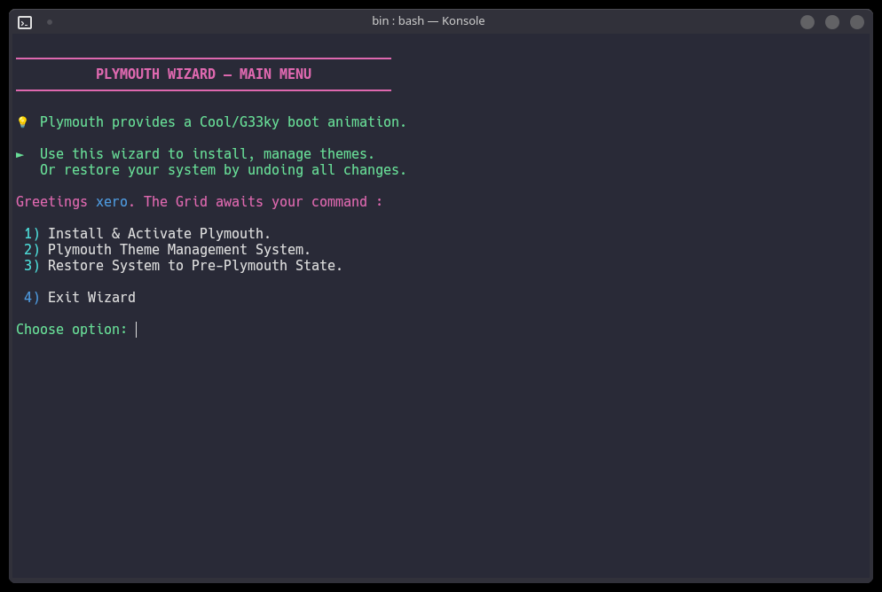

import { Image } from 'astro:assets';
import chaoticTool from '../../assets/images/chaotic-tool.png';
import chaoticTool3 from '../../assets/images/chaotic-tool3.png';

The **XeroLinux Customization Hub** is a PyQt6-based GUI tool that brings together all XeroLinux themes, rices, scripts, and system tools in one interface. It works on **any Arch-based system**, not just XeroLinux.


## Features

- **Desktop Rices** — Pre-configured desktop themes and layouts
- **GRUB Themes** — 8 bootloader themes
- **Scripts & Tools** — System utilities and configuration scripts

---

## Quick Start

### Dependencies

```bash
sudo pacman -S python python-pyqt6
```

### Run from Web

```bash
curl -fsSL https://xerolinux.xyz/script/xero-tool.py | python3
```

### Run Locally

```bash
curl -fsSL https://xerolinux.xyz/script/xero-tool.py -o xero-tool.py
python3 xero-tool.py
```

---

## Manual Installation

Each component can also be installed individually. All methods require:

```bash
sudo pacman -S --needed python python-pyqt6 python-pip python-pipx
```

### XeroLayan

The flagship KDE rice using [**Layan**](https://github.com/vinceliuice/Layan-kde) theme and [**Tela Circle**](https://github.com/vinceliuice/Tela-circle-icon-theme) icons.



```bash
git clone https://github.com/xerolinux/xero-layan-git
cd xero-layan-git/ && ./install.sh
```

**Included widgets:** [Apdatifier](https://store.kde.org/p/2135796), [Netspeed](https://store.kde.org/p/2136505), [Quick Shutdown](https://store.kde.org/p/1288430), [Wunderground PWS](https://store.kde.org/p/2135799), [Kurve Audio Visualizer](https://store.kde.org/p/2299506)

**KWin scripts:** [Karousel](https://github.com/peterfajdiga/karousel), [MouseTiler](https://github.com/rxappdev/MouseTiler), [Krohnkite](https://www.pling.com/p/2144146)

**Tweaks:** [Panel Colorizer](https://store.kde.org/p/2130967), [Smart Video Wallpaper](https://www.pling.com/p/2139746)

### Xero Cosmic


```bash
wget https://xerolinux.xyz/script/cosmic.sh
chmod +x cosmic.sh && sh cosmic.sh
```

### GRUB Themes


```bash
bash -c "python3 <(curl -fsSL 'https://xerolinux.xyz/script/grubs/xero-grubs.py')"
```

### Plymouth Manager



```bash
wget https://raw.githubusercontent.com/XeroLinuxDev/extra-scripts/refs/heads/main/usr/local/bin/xpm
chmod +x xpm && sh xpm
```

### Chaotic-AUR Tool (Unofficial)

<div class="img-row">
  <Image src={chaoticTool} alt="Chaotic-AUR Tool" />
  <Image src={chaoticTool3} alt="Chaotic-AUR Tool Settings" />
</div>

```bash
curl -fsSL "https://xerolinux.xyz/script/chaotic-tool.py" | python3
```

---

## Troubleshooting

### Plymouth Boot Delay

On fast NVMe systems, the boot animation may flash too quickly. Add a delay:

```bash
sudo systemctl edit plymouth-quit.service --drop-in=long_splash.conf
```

Add this content:

```ini
[Service]
ExecStartPre=/usr/bin/sleep 6
```


Adjust the `6` (seconds) to suit your hardware. Apply with:

```bash
sudo systemctl daemon-reload
```

### Plymouth Multi-Monitor

If the animation doesn't scale correctly across monitors, specify your primary display in GRUB:

```bash
sudo nano /etc/default/grub
```

Add to `GRUB_CMDLINE_LINUX_DEFAULT`:

```
video=DP-1:1920x1080@60
```

Replace `DP-1` with your monitor identifier (use `xrandr` to check). Then update GRUB:

```bash
sudo grub-mkconfig -o /boot/grub/grub.cfg
```
