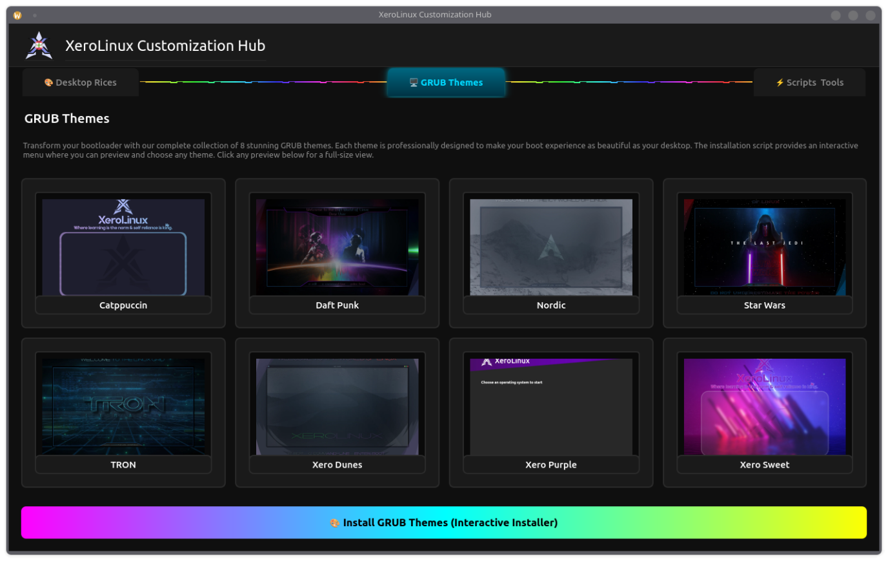
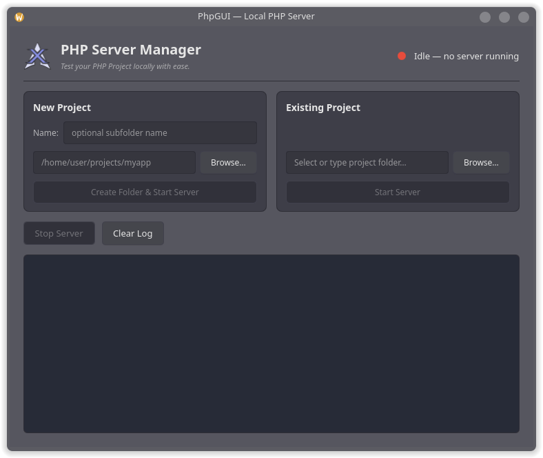
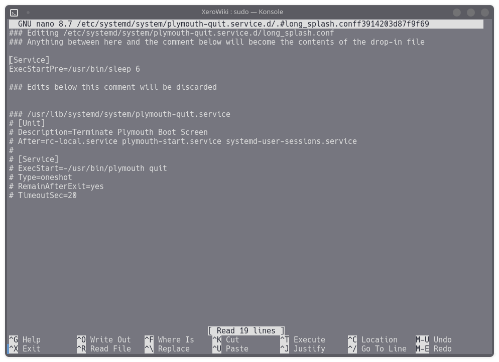

import { Image } from 'astro:assets';
import EFIBootGUIMain from '../../assets/images/EFIBootGUIMain.webp';
import EFIBootGUIAbout from '../../assets/images/EFIBootGUIAbout.webp';

<p class="page-tagline" id="tool-tagline"></p>

<script>{`
(function() {
  const taglines = [
    'Your desktop, your rules — we just provide the <code>toolkit</code>.',
    'Point. Click. Rice. No <code>config</code> files harmed.',
    'Because editing <code>dotfiles</code> at 3am gets old.',
    'A GUI for the ricing that used to take a <code>git clone</code>.',
    'All the customization, none of the <code>dependency</code> rabbit holes.',
    'Making <code>r/unixporn</code> submissions effortless since day one.',
    'Themes, scripts, and tools — all behind one <code>icon</code>.',
    'Rice responsibly. Or don\\u0027t. We won\\u0027t <code>judge</code>.',
    'PyQt6-powered — because even tools deserve to look <code>good</code>.',
    'One hub to customize them all, one hub to <code>theme</code> them.',
    'From stock to stunning in fewer <code>clicks</code> than you\\u0027d think.',
    'The <code>Swiss Army knife</code> of Linux desktop customization.',
  ];
  const el = document.getElementById("tool-tagline");
  if (el) el.innerHTML = taglines[Math.floor(Math.random() * taglines.length)];
})();
`}</script>

## Customization Hub

The **XeroLinux Customization Hub** is a PyQt6-based GUI tool that brings together all XeroLinux themes, rices, scripts, and system tools in one interface. It works on **any Arch-based system**, not just XeroLinux.



### Features

- **Desktop Rices** — Pre-configured desktop themes and layouts
- **GRUB Themes** — 8 bootloader themes
- **Scripts & Tools** — System utilities and configuration scripts

---

### Execution

- **Dependencies**

```bash
sudo pacman -S python python-pyqt6
```

- **Run from Web**

```bash
curl -fsSL https://xerolinux.xyz/script/xero-tool.py | python3
```

- **Run Locally**

```bash
curl -fsSL https://xerolinux.xyz/script/xero-tool.py -o xero-tool.py
python3 xero-tool.py
```

---

## EFIBoot Manager

<div class="img-row">
  <Image src={EFIBootGUIMain} alt="EFI Boot Manager Tool" />
  <Image src={EFIBootGUIAbout} alt="EFI Boot Manager About"/>
</div>

EFI Boot Manager GUI is a lightweight desktop app for Linux/KDE Plasma that lets you manage your UEFI/EFI boot entries without ever touching a terminal. **USE AT YOUR OWN RISK !**

### Features

  - Delete unwanted boot entries
  - Enable or disable individual boot entries
  - Reorder entries and apply a custom boot order
  - Confirm dialogs to prevent accidental changes
  - View all EFI boot entries with OS-specific icons
  - Native KDE Plasma look with blur/transparency support

### Installation

You need to be on **XeroLinux** to be able to install this. It's only available on our repo, nowhere else !

```bash
sudo pacman -Syy efibootmgrgui
```

---

## PHP Server GUI



**phpGUI** is a lightweight desktop app for Linux/KDE Plasma that lets you spin up a local PHP development server without ever touching a terminal.

### Features

  - Create a new project folder and serve it instantly
  - Browse for and serve any existing project directory
  - Clean two-card layout: New Project and Existing Project
  - Start a PHP built-in server (php -S) with a single click
  - Live log output — see server activity and errors in real time

### Installation

You need to be on **XeroLinux** to be able to install this. It's only available on our repo, nowhere else !

```bash
sudo pacman -Syy phpgui
```

---

## Troubleshooting

### Plymouth Boot Delay

On fast NVMe systems, the boot animation may flash too quickly. Add a delay:

```bash
sudo systemctl edit plymouth-quit.service --drop-in=long_splash.conf
```

Add this content:

```ini
[Service]
ExecStartPre=/usr/bin/sleep 6
```



Adjust the `6` (seconds) to suit your hardware. Apply with:

```bash
sudo systemctl daemon-reload
```

### Plymouth Multi-Monitor

If the animation doesn't scale correctly across monitors, specify your primary display in GRUB:

```bash
sudo nano /etc/default/grub
```

Add to `GRUB_CMDLINE_LINUX_DEFAULT`:

```
video=DP-1:1920x1080@60
```

Replace `DP-1` with your monitor identifier (use `xrandr` to check). Then update GRUB:

```bash
sudo grub-mkconfig -o /boot/grub/grub.cfg
```
